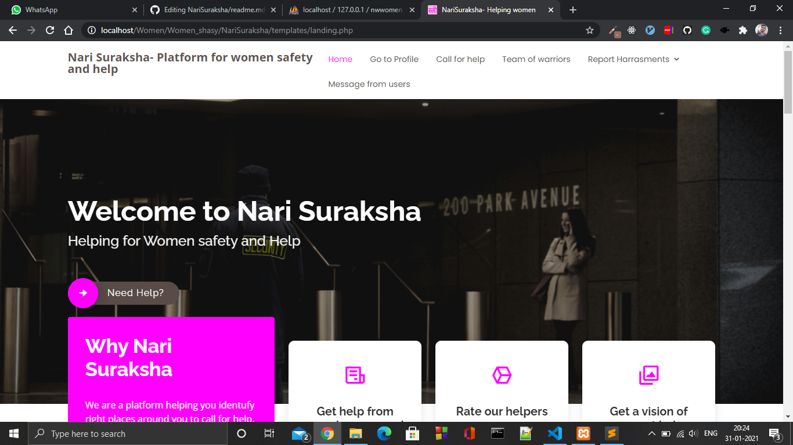
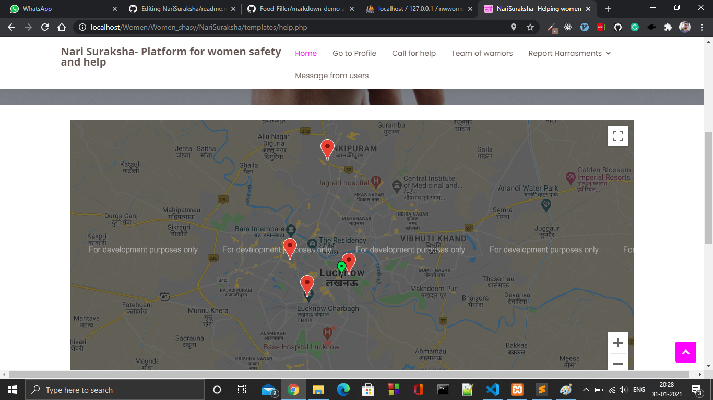

# Nari-Suraksha
Women face a lot of issues in the society. From returning late night and facing security issues to harrasment calls and abusive messages on various social media handles. Women try to avoid these, but no real charge is taken against these crimes. Also in case of emergency, women need help and help needs to reach in appropriate time.

Thus, this web portal help the women report these calls and also call for help. It helps them monitor the latest help available and also monitor and track their current location. They can get the fastest help by calling for help and also can report any instagram/ facebook handles and call numbers to get rid of them. The frequency of the numbers harrasing them and the content can also be reported which will help the security issues to be regarded easily.

##  Link for the Video- 
   > # https://youtu.be/FTWWbptUi-4

Nari Suraksha, Initiative to provide safety for womens.

## Screenshot of website


 
 
## Features

1. Responsive and User friendly UI
2. Home page of Nari Suraksha 
   * Info about website.
   * Link for help
   * Link for login to personal account 
   * Navbar containing Importent links to redirect to other pages.
3. About Page
   * Containing what functionalities we are providing 
   * Get all info abut website.
4. Profile Page
   * One of the most functionality covered page.
   * > Profile Page
       >> * If user is login, redirect to profile page
       >> * If not login redirect to login page
       >> * If not registered yet, by clicking register button from login, redirect to register button.
   * Containing all profile information like name, mail, dob,email, address, contact etc. 
   * > Sidebar of profile page Conating 
       >> * Profile pic.
       >> * All information.  
  
5. Call For Help
   * Here anyone can call for help.
   * Nearby help centers can be shown on google map.
   * All the help centeres will be added in database and live update on map.
   *  
6. Testimonial- 
   * One of the most important page of website, it presents
   * Working on it.
     * > Represent the info about testimonials provided by user  
7. Contact Us 
   * Can find other info related to NariSuraksha Portal.   
8. REGISTER Help Center
   * Here an HELP center can register itself.
   * Pending    

---

## Technology stacks used in project: Web Technology
*  Frontend
   * HTML
   * CSS
   * JS
   * Bootstrap
*  Tools
   * Git
   * Github
   * Php
   * Php MyAdmin
*  Backend
   * Apache Server
   * MySql
*  Execution of project
   * Apache Server, using XAMPP
   
## Instruction to USE web application

*  Download the zip file or clone this repo using following command
   
     ``` bash
         git clone https://github.com/shivammaniharsahu/NariSuraksha.git
     ```
*  Install XAMPP to run server by this link
     ``` bash
         https://www.apachefriends.org/download.html
     ```    
         
*  Go to directory C:\xampp\htdocs\
     ``` bash
         Paste here cloned project(Unzipped File) 
     ```
*  Import SQL file into phpMyAdmin (registration.sql)

*  Run XAMPP server by opening XAMPP application
     ``` bash
         Run Apache molule.
         For Php MyAdmin run MySQL server. 
     ```     
*  Run the project on local server by this link
     ``` bash
         http://localhost/ 
     ```  
*  Hurrey! 😎, Our project running on localhost  

## Php MyAdmin

*  Added database, run sql file in database.

## Backbones of project(Contributors)

>| S.No.         | Name                  | Work Field                                   | Github Account                            |
>| ------------- |:---------------------:|:--------------------------------------------:|:-----------------------------------------:| 
>| 1             | Shivam Manihar Sahu   | Manage Databases- Worked on sql queries      |  https://github.com/shivammaniharsahu/    |
>| 2             | Shashwat Awasthi      | UI/UX design of Website, Worked on frontend  |  https://github.com/ShashwatAwasthi04     |
>| 3             | Rahul Singh Kushawaha | Worked on frontend of project,database work  |  https://github.com/Rahul-skush           | 
>| 4             | Ajay Kumar            | Worked on PHP backend, Query Processing      |  https://github.com/AJAYKR00KJ            |

---
     
     

    

   
   
